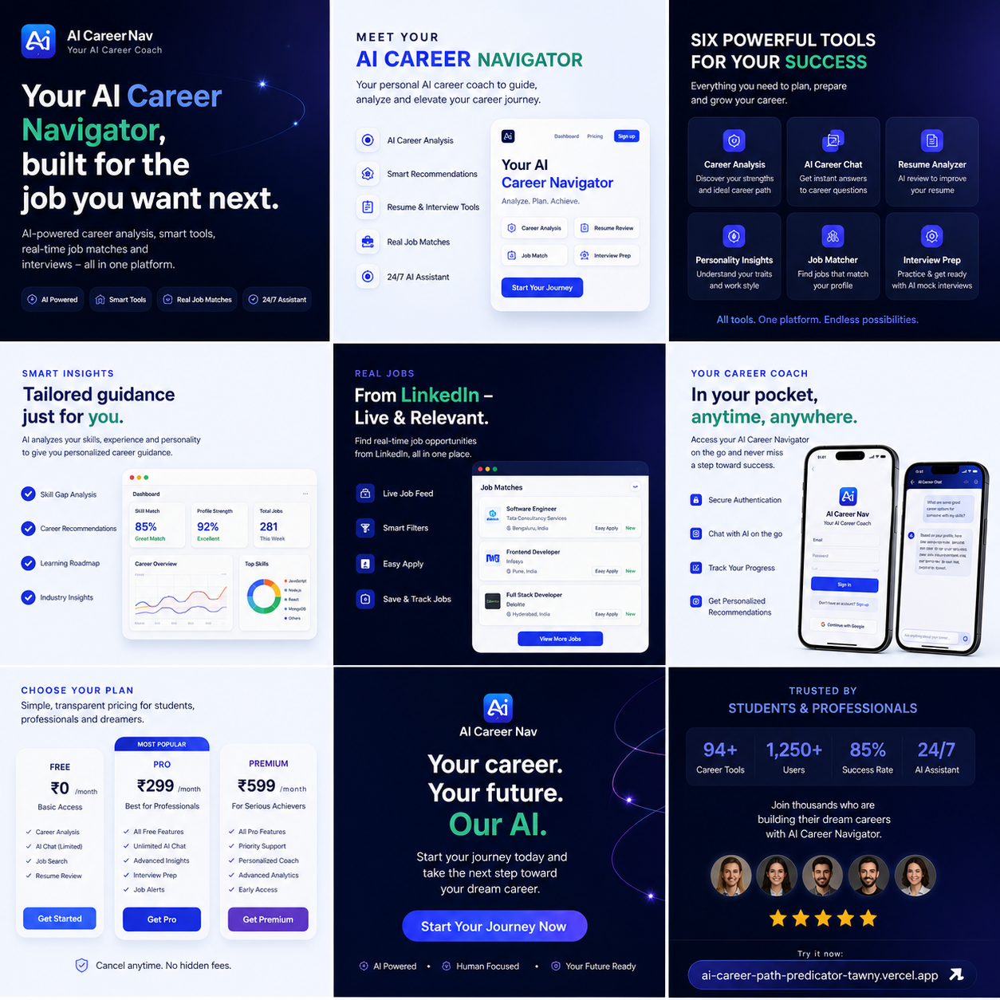

# AI Career Navigator

A full-stack AI-powered career platform that helps users explore career paths, analyse resumes, find jobs, and get personalised guidance — all in one place.

[](https://ai-career-path-predicator-tawny.vercel.app)

**Live Links**
- Live: [ai-career-path-predicator-tawny.vercel.app](https://ai-career-path-predicator-tawny.vercel.app)

---

## Features

| Feature | Description |
|---|---|
| **Career Assessment** | Submit your skills and interests; get AI-generated career path recommendations |
| **AI Chat Assistant** | Ask anything about resumes, interviews, job search, or career growth |
| **Resume Analyser** | Upload a PDF resume; extract skills, experience years, and structured data |
| **Personality & Insights** | Generate a career personality profile from free-text input using Groq AI |
| **Job Matching** | Search LinkedIn public listings by keyword and location via Puppeteer |
| **Progress Tracker** | Review your full assessment and AI insight history in one view |
| **Dashboard Analytics** | Live charts — activity trends, top skills, career interests, assessment depth |
| **Resource Recommendations** | Get curated learning resources matched to your skills and interests |
| **Auth & Profile** | JWT-based auth with register, login, password reset, and profile editing |
| **Feedback & Contact** | In-app feedback form and contact form delivered via Gmail SMTP |
| **Dark / Light Theme** | Toggle between dark and light UI modes from Account Settings |
| **Floating Chat Widget** | AI chat accessible from any authenticated page via a floating button |

---

## Tech Stack

| Layer | Technology |
|---|---|
| **Frontend** | Next.js 15, React 19, TypeScript, Tailwind CSS v4 |
| **Backend** | Node.js, Express 5 |
| **Database** | MongoDB with Mongoose |
| **AI** | Groq API |
| **Charts** | Recharts 3 (React 19 compatible) |
| **Authentication** | JWT + bcryptjs |
| **Validation** | Joi — every request body/query/file validated before reaching controllers |
| **File Upload** | Multer + pdf-parse |
| **Email** | Nodemailer with Gmail SMTP |
| **Job Search** | Puppeteer + LinkedIn public job listings |
| **API Docs** | Swagger UI (`/v1/docs`) |

---

## Project Structure

```
ai-career-nav/
├── frontend-app/                   # Next.js 15 client (App Router)
│   └── src/
│       ├── app/                    # Pages (one folder per route)
│       │   ├── homepage/           # Main authenticated dashboard
│       │   ├── career-navigator/   # AI career assessment tool
│       │   ├── progress-tracker/   # Assessment & insight history
│       │   ├── insights/           # Personality & trends AI
│       │   ├── chatbot/            # Full-page AI chat
│       │   ├── resume-analyzer/    # PDF upload + NLP results
│       │   ├── job-matching/       # LinkedIn job search
│       │   ├── profile/            # User profile editor
│       │   ├── account-settings/   # Password, theme, notifications
│       │   ├── feedback/           # In-app feedback form
│       │   ├── login/ register/    # Public auth pages
│       │   ├── globals.css         # Design system tokens + shared classes
│       │   └── responsive.css      # All breakpoint overrides
│       ├── components/             # Shared UI components
│       │   ├── charts/             # Recharts chart components
│       │   │   ├── ActivityLineChart.tsx
│       │   │   ├── SkillsBarChart.tsx
│       │   │   ├── AssessmentColumnChart.tsx
│       │   │   └── InterestsDonutChart.tsx
│       │   ├── ClientLayout.tsx    # Auth guard + sidebar + floating chat
│       │   ├── FloatingChat.tsx    # AI chat widget (accessible from all pages)
│       │   ├── Sidebar.tsx
│       │   ├── AppHeader.tsx
│       │   └── ...
│       ├── api/                    # Thin Axios wrappers per domain
│       └── lib/                    # axios instance, path helpers
│
├── backend-app/                    # Express 5 API
│   └── src/
│       ├── controllers/            # HTTP handlers
│       ├── services/               # Business logic + Groq/Puppeteer
│       ├── models/                 # Mongoose schemas
│       ├── routes/v1/              # Route definitions
│       ├── validations/            # Joi schemas (one file per area)
│       └── middleware/             # Auth JWT + Joi validate
│
└── render.yaml                     # Render deployment blueprint
```

---

## Prerequisites

- Node.js 20+
- npm
- MongoDB (local or Atlas)
- Groq API key
- Gmail App Password — for contact and feedback emails

---

## Run Locally

### 1. Clone and install

```bash
git clone <your-repository-url>
cd ai-career-nav

# Backend
cd backend-app
npm install          # also runs npm run install:chrome for Puppeteer

# Frontend
cd ../frontend-app
npm install
```

### 2. Configure environment variables

**`backend-app/.env`**

```env
PORT=5000
NODE_ENV=development
MONGO_URI=mongodb://localhost:27017/ai-career-nav
JWT_SECRET=replace-with-a-long-random-secret
GROQ_API_KEY=your-groq-api-key
SMTP_USER=your-gmail-address@gmail.com
SMTP_PASS=your-gmail-app-password
CORS_ORIGIN=http://localhost:3000
```

**`frontend-app/.env.local`**

```env
NEXT_PUBLIC_BASE_API_URL=http://localhost:5000/v1/
```

### 3. Start both servers

```bash
# Terminal 1 — API
cd backend-app && npm run dev

# Terminal 2 — Frontend
cd frontend-app && npm run dev
```

| Service | URL |
|---|---|
| Frontend | http://localhost:3000 |
| Backend API | http://localhost:5000 |
| Swagger UI | http://localhost:5000/v1/docs |

---

## API Reference

The development prefix is `/v1`. In production (`NODE_ENV=production`) the prefix is `/api`.

### Auth

| Method | Endpoint | Auth | Body |
|---|---|---|---|
| `POST` | `/auth/register` | — | `name`, `email`, `password` |
| `POST` | `/auth/login` | — | `email`, `password` |
| `POST` | `/auth/forgot-password` | — | `email` |
| `POST` | `/auth/reset-password` | — | `token`, `password` |
| `GET` | `/auth/profile` | JWT | — |
| `PUT` | `/auth/profile` | JWT | Any profile field |

### Core Features

| Method | Endpoint | Auth | Body / Notes |
|---|---|---|---|
| `POST` | `/assessment` | JWT | `skills[]`, `interests[]` |
| `GET` | `/assessment/history` | JWT | — |
| `POST` | `/chat` | JWT | `message` |
| `POST` | `/resume/upload` | JWT | `multipart/form-data` — field `resume`, PDF ≤ 10 MB |
| `POST` | `/insights` | JWT | `input` |
| `GET` | `/dashboard/analytics` | JWT | — |
| `POST` | `/resources` | — | `skills[]`, `interests[]` |
| `POST` | `/job-matching` | — | `keyword`, `location` |
| `POST` | `/contact` | — | `name`, `email`, `subject`, `message` |
| `POST` | `/feedback` | — | `rating`, `category`, `message`; optional `name`, `email` |

### Authentication Flow

Login and register return a JWT. Attach it to protected requests:

```http
Authorization: Bearer <token>
```

The frontend stores the token under `token` and the user object under `user` in `localStorage`. Tokens expire after 7 days.

### Example — Career Assessment

```http
POST /v1/assessment
Authorization: Bearer <token>
Content-Type: application/json

{
  "skills": ["JavaScript", "React", "Node.js"],
  "interests": ["Web Development", "AI", "Startups"]
}
```

---

## Validation Architecture

Every endpoint that accepts data uses a Joi schema. The `validate` middleware checks `body`, `query`, `params`, and uploaded `file` before the request reaches any controller, returning HTTP `400` with a structured `errors` array on failure.

```
backend-app/src/validations/
├── auth.validation.js
├── assessment.validation.js
├── chat.validation.js
├── contact.validation.js
├── feedback.validation.js
├── insights.validation.js
├── jobMatching.validation.js
├── resources.validation.js
└── resume.validation.js
```

---

## Dashboard & Charts

The dashboard (`/homepage`) uses **Recharts 3** (React 19 compatible) with four dedicated chart components:

| Component | Chart Type | Data |
|---|---|---|
| `ActivityLineChart` | Dual-line area chart | Assessments + AI insights over 7 days |
| `SkillsBarChart` | Horizontal bar | Top skills by mention count |
| `AssessmentColumnChart` | Vertical bar | Skills count per assessment |
| `InterestsDonutChart` | Donut / pie | Career interest distribution |

All charts use `ResponsiveContainer`, dark custom tooltips, graceful empty states, and CSS custom property tokens for dark/light theme support.

---

## Job Matching and Puppeteer

Job matching scrapes LinkedIn public listings using a headless Chrome browser. The Chrome binary is installed separately:

```bash
cd backend-app
npm run install:chrome
```

If the endpoint returns `Could not find Chrome`, reinstall the binary:

```bash
npm run install:chrome
```

To force a clean install, delete the incomplete folder inside `backend-app/.cache/puppeteer/chrome/` then run the command again.

LinkedIn can rate-limit requests or change page structure. Those failures are unrelated to Chrome installation and may still return HTTP `500`.

---

## Scripts

### Backend

```bash
npm start               # Production server
npm run dev             # Dev server with nodemon
npm run install:chrome  # Install Puppeteer Chrome binary
npm run lint            # ESLint check
npm run lint:fix        # ESLint auto-fix
npm run prettier        # Prettier check
npm run prettier:fix    # Prettier auto-format
```

### Frontend

```bash
npm run dev         # Next.js dev server (port 3000)
npm run build       # Production build
npm start           # Start production server
npm run compile-ts  # TypeScript type-check (no emit)
npm run lint        # ESLint check
npm run lint:fix    # ESLint auto-fix
```

---

## Team

| Name | Role |
|---|---|
| Achal Kumar | Software Engineer |
| Adarsh Bhagat | AI Engineer |
| Aastha Jaiswal | DevOps Engineer |
| Sachin Kumar | Full Stack Developer |

---

© 2026 CareerNav. Built with Next.js, Express, MongoDB, and Groq AI.
